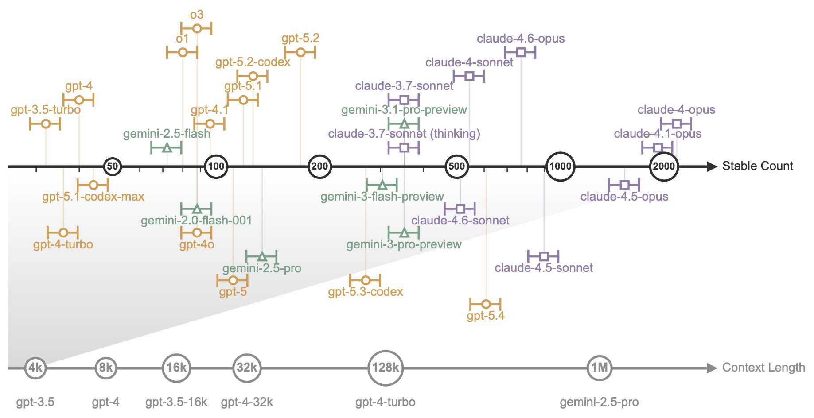

# Language models fail at extended rule following

[](LICENSE)
[](https://www.python.org/downloads/)

This repository contains the code and data for the study *Language models fail at extended rule following* ([arXiv:2605.02028](https://arxiv.org/abs/2605.02028)).

We study extended rule following through exact counting and related structural tracking tasks. The core benchmark is SCC: models are shown long repeated-token sequences and asked to return the exact count as a single integer. SCC measures CC, the counting capacity, with an adaptive randomized ladder that distinguishes reliable rule execution from coarse length heuristics. The study also covers matched dual-task counting controls, motif-ablation data, a heterogeneous nested key-path matching benchmark for non-homogeneous tracking, cross-benchmark comparison tables, and Gemma 3 / Gemma Scope 2 plus Qwen 3.5 mechanistic analysis outputs.

Project page: [https://txdai.github.io/llm-extended-rule-following/](https://txdai.github.io/llm-extended-rule-following/). The supplementary information is available there, and you can also [try the prompt generator yourself](https://txdai.github.io/llm-extended-rule-following/).



## Repository Layout

- `run_scc_benchmark.py`: SCC benchmark runner for measuring CC across OpenAI, Google GenAI, Anthropic, and OpenRouter backends.
- `run_count_scatter_controls.py`: matched dual-task counting-control runner with code and dual-count distractor controls.
- `run_agent_count_disruption.py`: agent-style disruption benchmark testing whether count-heavy prompts destabilize JSON externalization and downstream state tracking.
- `run_stimulus_ablation.py`: motif / delimiter ablation runner.
- `run_nested_key_path.py`: heterogeneous nested key-path matching assay for non-homogeneous structural tracking.
- `analyze_gemma_counting.py`: Gemma 3 27B IT mechanistic counting analysis with Gemma Scope 2 features.
- `analyze_gemma_motif_invariance.py`: motif-invariance analysis for the Gemma mechanistic study.
- `analyze_gemma_counter_projection_clamping.py`: targeted causal counter-projection clamping analysis for the Gemma mechanistic study.
- `analyze_gemma_token_anchor_states.py`: token-anchor comparison across assistant-prefix, last-item, and last-separator states.
- `analyze_gemma_assistant_prefix_donor_patching.py`: late-token donor-patching study on the assistant-prefix state.
- `analyze_gemma_sequence_donor_patching.py`: full-sequence donor-patching study across residual layers.
- `analyze_gemma_sequence_linear_patching.py`: full-sequence linear-trajectory patching study across residual layers.
- `analyze_qwen_counting.py`: Qwen 3.5 35B A3B mechanistic counting analysis without SAE features.
- `analyze_qwen_counter_projection_clamping.py`: targeted Qwen counter-projection clamping analysis.
- `download_gemmascope_subset.py`: helper for downloading the minimal Gemma Scope 2 SAE subset used here.
- `configs/benchmarks/`: runnable benchmark configurations.
- `configs/model_lists/`: model catalogs used by the benchmark configs.
- `data/`: cleaned raw outputs and derived tables needed to reproduce the released data products.

## Included Data

- `data/scc_closed_model_runs/`: closed-model SCC benchmark runs and CC tables.
- `data/scc_open_model_runs/`: open-model SCC benchmark runs and CC tables.
- `data/count_scatter_control_runs/`: matched dual-task counting-control runs with seven released conditions.
- `data/agent_count_disruption_tables/`: released count-level and condition-level summary tables for the agent disruption benchmark.
- `data/scc_stimulus_ablation_runs/`: motif and delimiter ablation runs.
- `data/scc_nested_key_path_runs/`: heterogeneous nested key-path runs.
- `data/gemma_counting_mechanistic_analysis/`: Gemma 3 mechanistic counting payloads.
- `data/gemma_motif_invariance_analysis/`: Gemma motif-invariance payloads.
- `data/gemma_counter_projection_clamping/`: causal counter-projection clamping payloads confirming the non-rescue intervention result.
- `data/gemma_token_anchor_state_analysis/`: anchor-specific Gemma latent-state comparisons.
- `data/gemma_assistant_prefix_donor_patching/`: assistant-prefix donor-patching payloads.
- `data/gemma_sequence_donor_patching/`: full-sequence donor-patching payloads.
- `data/gemma_sequence_linear_patching/`: full-sequence linear patching payloads.
- `data/qwen_counting_mechanistic_analysis/`: Qwen mechanistic counting payloads.
- `data/qwen_counter_projection_clamping/`: Qwen counter-projection clamping payloads.
- `data/evaluated_model_inventory.csv`: consolidated evaluated-model table.

## Setup

Use Python 3.10 or newer, then create an environment and install the dependencies:

```bash
python3 -m venv .venv
source .venv/bin/activate
pip install -r requirements.txt
```

Backend credentials are read from environment variables:

- `OPENAI_API_KEY`
- `GOOGLE_API_KEY` or `GEMINI_API_KEY`
- `ANTHROPIC_API_KEY`
- `OPENROUTER_API_KEY`

## Reproducing The Data

Run SCC to measure CC:

```bash
python3 run_scc_benchmark.py --config configs/benchmarks/scc_closed_openai.json
python3 run_scc_benchmark.py --config configs/benchmarks/scc_closed_anthropic.json
python3 run_scc_benchmark.py --config configs/benchmarks/scc_closed_google.json
python3 run_scc_benchmark.py --config configs/benchmarks/scc_open_openrouter.json
```

Run the motif-ablation benchmark:

```bash
python3 run_stimulus_ablation.py
```

Run the matched dual-task counting controls:

```bash
python3 run_count_scatter_controls.py --config configs/benchmarks/count_scatter_control.json
```

Run the agent disruption benchmark:

```bash
python3 run_agent_count_disruption.py --config configs/benchmarks/agent_count_disruption.json
```

Run the heterogeneous nested assay:

```bash
python3 run_nested_key_path.py
```

## Gemma Mechanistic Analysis

The mechanistic analysis targets local `gemma-3-27b-it` weights together with a local Gemma Scope 2 subset. Download the SAE subset with:

```bash
python3 download_gemmascope_subset.py
```

Then run:

```bash
python3 analyze_gemma_counting.py
python3 analyze_gemma_motif_invariance.py
python3 analyze_gemma_counter_projection_clamping.py
python3 analyze_gemma_token_anchor_states.py
python3 analyze_gemma_assistant_prefix_donor_patching.py
python3 analyze_gemma_sequence_donor_patching.py
python3 analyze_gemma_sequence_linear_patching.py
```

These scripts write JSON, CSV, and NPZ payloads under `data/`. The counter-projection clamping, token-anchor, and donor-patching analyses reproduce the targeted causal interventions reported in the manuscript's Gemma mechanistic section.

## Qwen Mechanistic Analysis

The Qwen mechanistic analysis targets local `Qwen3.5-35B-A3B` weights. Run:

```bash
python3 analyze_qwen_counting.py
python3 analyze_qwen_counter_projection_clamping.py
```

These scripts write cleaned JSON and NPZ payloads under `data/` and mirror the released Qwen mechanistic results.

## Notes

- The repository includes data-generation and data-aggregation code together with the shipped benchmark and analysis outputs.
- The source snapshot for the agent disruption benchmark did not include the original raw run directory. The bundled `data/agent_count_disruption_tables/` files are machine-readable tables derived from the released markdown summaries in `Counting/results/agent/`.
- Manuscript files are not included in this repository.

## License

Code in this repository is released under the Apache License 2.0. See `LICENSE`.

Original project data in this repository are released under MIT terms.
